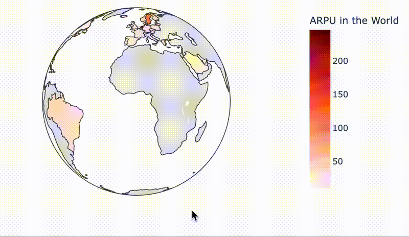
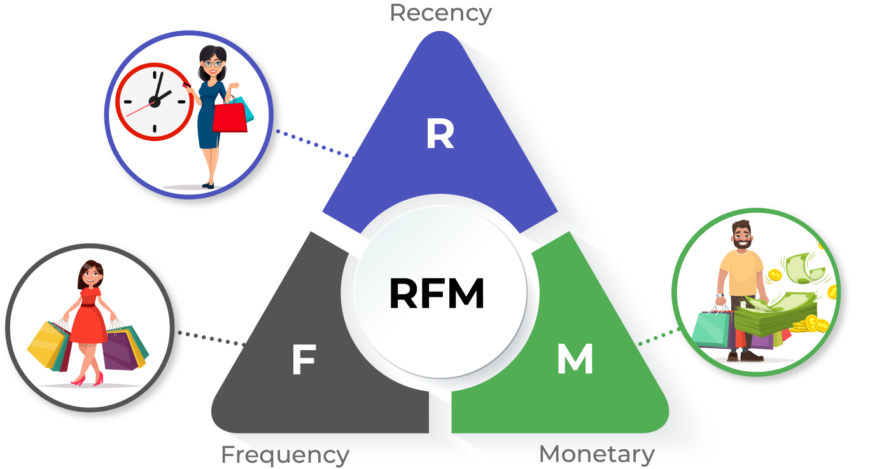

# E-Commerce Data - Retail Evidence for Clustering Approach

- This project was devolopment to understand how segmentation works in the clients, we using Machine Learning Algorithms, in specific Unsupervisioned Learning. Using different tips for analyse customer segmentation on the database extract query. 

- Extremally important this data used by the kaggle project: [Ecommerce Data](https://www.kaggle.com/datasets/carrie1/ecommerce-data)

- This project use different methods to apply of cluster how work the process for using PCA Algortihms (reduction the dimension), Kmeans (for cluster) and using [Elbow Method](https://en.wikipedia.org/wiki/Elbow_method_(clustering)) to find best way of obtain the number of the required cluster with data that have.

- Insights obtain for this approach, all of this things depends what your interest, what is metric more important to you in present moment, whats your experiment, what best allocation for the segmentation the customer on database that have. 

## File Structure & Compiling : 
#### We using this structure:
```
retail-e-commerce-evidence/
├── analytics
│   ├── client_value.ipynb
│   ├── metrics_world.ipynb
│   └── retails.ipynb
├── data
│   └── data_encoding.csv
├── queries
│   ├── filter_values_returned.sql
│   ├── insert_varclients.py
│   ├── main_country_consumption.sql
│   ├── mostvalue_client.sql
│   └── retail.db
├── README.MD
├── requirements.txt
└── updates.txt
```
* analytics/: Contains all of the analysis, process segmentation and optization of the algorithm; you will see the process for categorization using `Kmeans`, `Elbow Method` and `PCA`. Here we using the method of RFM (Recency, Frequency, Monetary) important in the context for e-commerce, identify the oportunities and know more about your clients, potential new outcomes.

* data/: Basicly first data, not have treatment, will use to understand of data and the read for cleanning and filters data.

* queries/: Here we using .SQL methods to cleanning & manipulating database. We using also the `insert_varclients.py` to update database and make more alterations in the retail.db, we using this enviroment to cat the `data_encoding.csv` to guard in the `retail.db`, this process it very important to filter & cleanning the data.

#### Compiling:

First you will need download the dependencie, soo you will instaling the enviroment we use to compiling the library.
``` 
    python3 venv .venv
```

After this you will need activate this enviroment

```
    source .venv/bin/activate
```

Now you can download this library: 

```
    pip install -r requirements.txt
```

## You can see the global revenue with the metric ARPU: 

* This metric consist in the 'Average Revenue Per User', we using to identify which country is better perform in the product, what have Customer more interest in therms of Revenue, we can see in this graph interactive: 

<div align="center">
  
</div>

## Database Cleanning & Find the Right Customer

* With the queries in the `./queries` we use to made transformation in the data, using different steps to segmentation filter, cleanning, using like `CTE` for step by step consolidating the data final.

* Identifying more about the database, have examples of `Products inside the database,that don't have CustomerID, Products not name`

* Undestand also about process of returned product, when client buy something, but don`t use every of this thing or this thing have problem him don't work very well, soo the customer back to shop to receive your money.


## Elbow Method - Best Cluster Distance

* This constant method used to identify optimazation for Kmeans cluster. We define to find the best cluster optimal point. What happeneed in highly the quantity  of cluster in Kmeans that have difference between the clusters if abble to very small, and the difference of observation intra-clusters will increasing. Soo we need to find equilibrium in the observation that made each group would more possibly homeigeneity and that the formed group would more different what the others.


## Conclusion

In this dataset, we identify best oportunities and data analysis, to understand what is the Customer we have for each country, and search what best devolopment to define which metrics are import to us, this dataset give to me the oportunity to learning about the Elbow Method, learning more about the RFM (Recency, Frequency, Monetary) it is very important in context for marketing science, making experimentation with this database, find the deliver best solution for you customer based on your behavior.

<div align="center">  
    
    </img>
</div>
